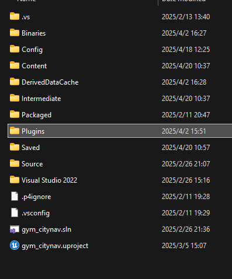
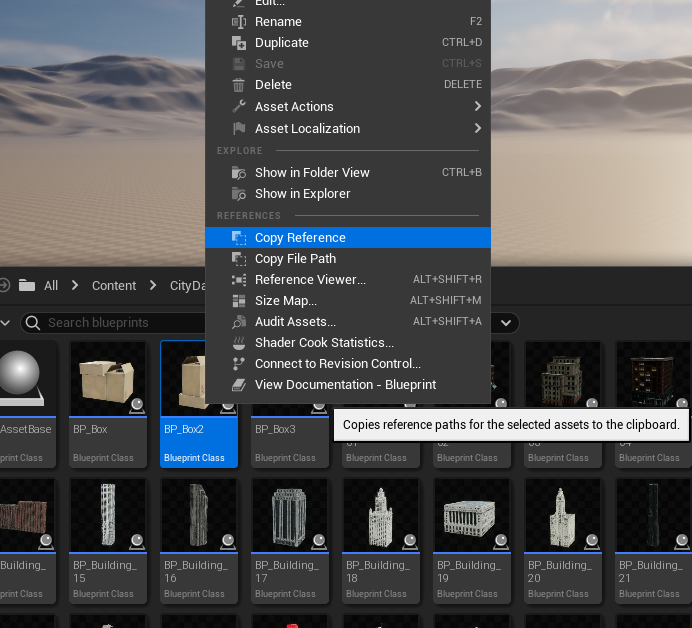

# Qualification Task
## Overview
+ `.\unrealcv` is a plugin for UE project. Copy the folder `.\unrealcv` to your project under folder `Plugins`.

+ `unrealcv_basic.py` shows how to control UE in Python. Read the file carefully to see how we use UnrealCV in our project. 

## How to Generate a Blueprint
**Follow `stub.ipynb` to start.** \
Some hints:

1. First you should create a blueprint class in UE. Try to figure out how to do it by yourself.
2. Use `spawn_bp_asset(prefab_path, name)` to generate the blueprint. `prefab_path` is the reference in UE (e.g. `/Game/CityDatabase/blueprints/BP_Building_01.BP_Building_01_C`). Right click the blueprint in UE and choose `Copy Reference`, you will get the `prefab_path` (may need small modification here to get given format).
You can set `name` as what you want.
